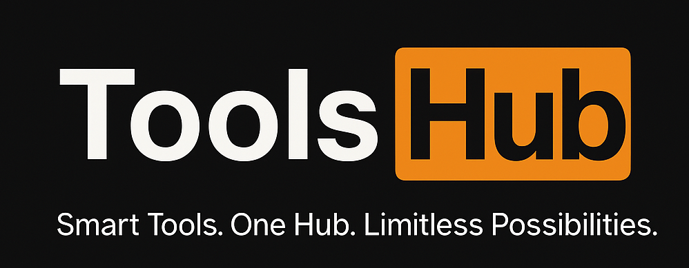
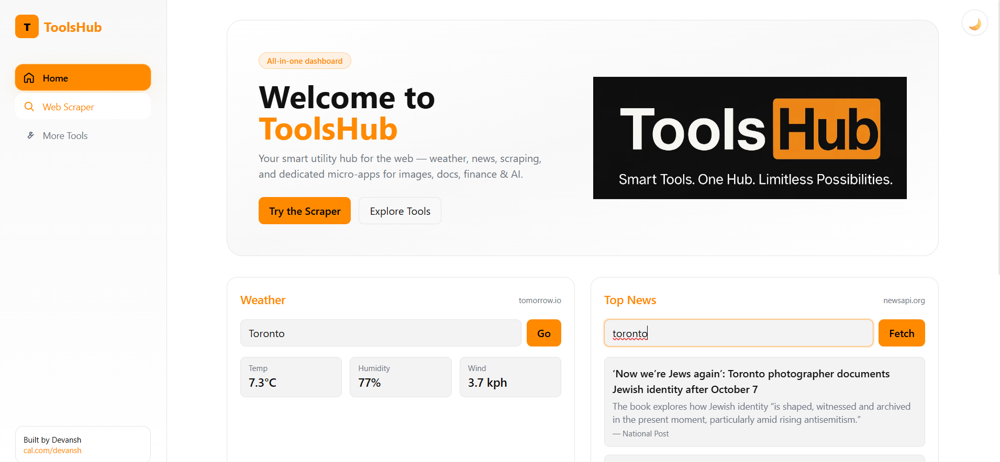
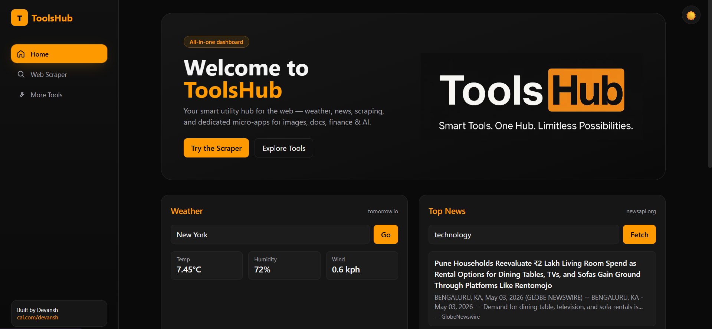
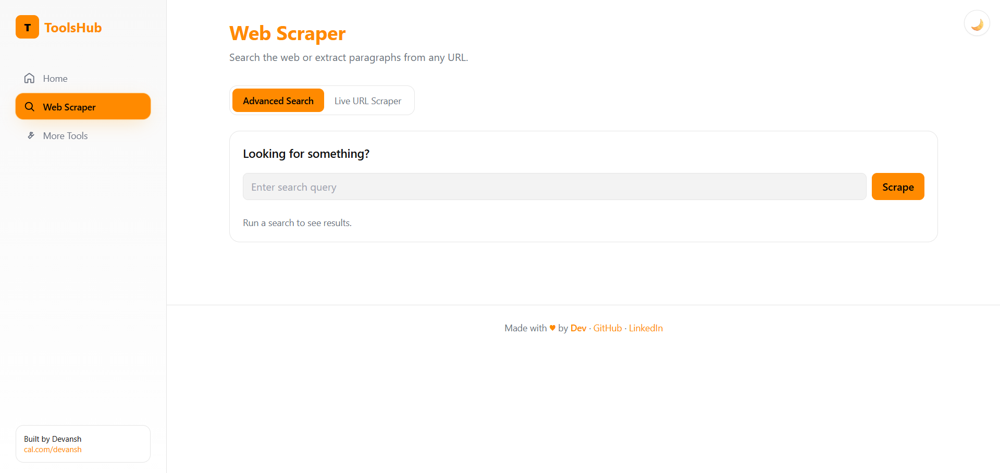
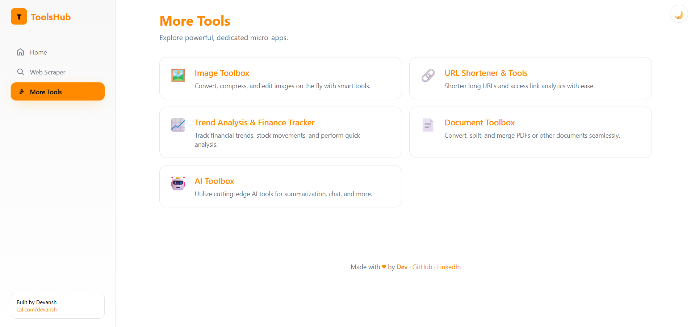
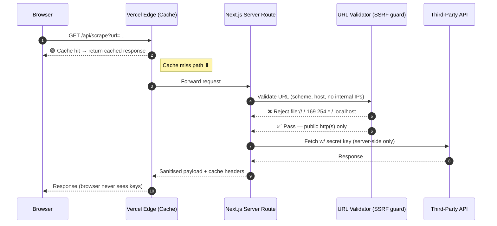

# 🛠 ToolsHub

### Production-grade multi-API dashboard — built solo, shipped in days.

_A case study in shipping a polished web product with **DevSecOps rigor** baked in from day one._

 

 

---

## 🚀 Try it live

> **🔗 [toolshub-eta.vercel.app](https://toolshub-eta.vercel.app/)** — no signup, no setup. Click any feature and play.

---

## 📸 At a glance

<table>
  <tr>
    <td width="50%"><b>Home — Light</b> </td>
    <td width="50%"><b>Home — Dark</b> </td>
  </tr>
  <tr>
    <td><b>Web Scraper</b> </td>
    <td><b>More Tools</b> </td>
  </tr>
</table>

---

## 🧠 Why this exists

ToolsHub is a portfolio case study, not just a side project. It exists to demonstrate that I ship **product-grade web apps with the security, infrastructure, and reliability discipline most freelancers skip**.

Every architectural choice below was deliberate. None of it is "default Next.js." It's the same engineering bar I bring to client work.

---

## 🏛 Architecture — one request, end to end

**Key invariants enforced by this flow:**
- API keys never reach the browser bundle.
- Server-side URL validation blocks SSRF before any outbound fetch.
- Edge cache layer protects third-party quotas and keeps repeat loads instant.

---

## 🛡 Production engineering details

| Concern | Implementation |
|---|---|
| **API key isolation** | All third-party calls proxied through server routes. Zero secrets in client bundle. |
| **SSRF protection** | URL scheme + host validation pipeline before every outbound fetch. Blocks `file://`, `gopher://`, internal RFC1918 ranges, link-local, `localhost`. |
| **Rate-limit hygiene** | Edge-cached responses with TTL tuned per upstream API to stay under free-tier quotas. |
| **Type safety** | Strict TypeScript end-to-end. API contracts typed at both server and client; no `any` escape hatches. |
| **Theme without flash** | Pre-paint inline script applies stored theme before React hydrates. Zero FOUC on first load. |
| **Design tokens** | Single source of truth via CSS variables; every component is theme-aware automatically. |
| **Error boundaries** | Per-module error isolation — a failing news API doesn't take down weather. |

---

## ✨ What it does

ToolsHub is a unified dashboard for the everyday web — one tab instead of five.

| | Module | What you can do |
|---|---|---|
| 🌡 | **Weather** | Real-time temperature, humidity & wind for any city |
| 📰 | **News** | Top headlines by keyword, refreshed live |
| 🔍 | **Smart Search** | Web search with auto **USD → INR** conversion on prices |
| 🧹 | **URL Extractor** | SSRF-safe text extraction from any public web page |
| 🖼 | **Image Toolbox** | Convert, compress, edit on the fly |
| 🔗 | **URL Shortener** | Shorten links with click analytics |
| 📈 | **Finance Tracker** | Trends, stocks, quick analysis |
| 📄 | **Document Toolbox** | Convert, split, merge PDFs |
| 🤖 | **AI Toolbox** | Summarisation, chat, custom integrations |

---

## 🧰 Stack

**Next.js 14 (App Router)** · **TypeScript (strict)** · **Tailwind CSS** · **Cheerio** · **Vercel Edge**

External APIs: Tomorrow.io · NewsAPI · SerpAPI · ExchangeRate-API

---

## 🔭 What I'd do differently at scale

Honest engineering notes — what would change if this had 100k DAU instead of being a portfolio piece:

- **Move proxy layer to a dedicated API gateway** (AWS API Gateway + Lambda or self-hosted Kong) for finer rate-limit control per consumer.
- **Replace edge cache with Redis + stale-while-revalidate** for cross-region consistency.
- **Add structured logging + Prometheus metrics** on the proxy layer; pipe to Grafana for upstream-API SLO dashboards.
- **CI/CD with security gates** — Trivy on container builds, Terrascan on IaC, SonarQube quality gate. (This is my day job.)
- **Per-tenant API key vault** if multi-tenant — AWS Secrets Manager + IAM-scoped retrieval.

---

## 👋 About the builder

<h3>Hi, I'm <b>Devansh Mishra</b>.</h3>

I build <b>production-grade web products and the infrastructure they run on</b> — end to end, solo, in days not months.

My edge isn't "I know Next.js." It's that I bring <b>DevOps and DevSecOps discipline</b> to product work that most freelancers ship without it.

### 💡 What I build for clients

- 🛠 **Production-grade internal tools & admin dashboards** — Next.js + TypeScript + AWS, shipped in 1–3 weeks.
- 🤖 **AI-augmented automation** — LLM-driven workflows, agentic pipelines, fault-tolerant orchestration (Temporal).
- 🔒 **DevSecOps CI/CD pipelines** — GitHub Actions / Jenkins with Trivy, SonarQube, Terrascan, OWASP gates.
- ☁ **Cloud infrastructure** — AWS (EKS, EC2, VPC, IAM), Terraform, Helm, ArgoCD GitOps.
- 📊 **Observability stacks** — Prometheus + Grafana, structured logging, SLO dashboards.

### ⚡ Why hire me vs. another freelancer

- I ship products **and** the infra they run on — fewer vendors, fewer handoffs.
- Security and CI/CD discipline included by default, not an upsell.
- Work hours overlap **US Eastern evenings · UK/EU afternoons · UAE evenings**.
- Fixed-price engagements available for well-scoped work.

### 📅 Let's talk

| | |
|---|---|
| 📅 **Book a 15-min intro call** | [cal.com/YOUR-CAL-SLUG](https://cal.com/YOUR-CAL-SLUG) |
| 💼 **LinkedIn** | [linkedin.com/in/dev-ice](https://www.linkedin.com/in/dev-ice) |
| 🐙 **GitHub** | [github.com/dev-comett](https://github.com/dev-comett) |

---

### Like what you see?

**[▶ Open Live Demo](https://toolshub-eta.vercel.app/)** &nbsp;·&nbsp; **[📅 Book a Call](https://cal.com/YOUR-CAL-SLUG)**

_Available for freelance engagements · Remote · Fixed-price or retainer_

